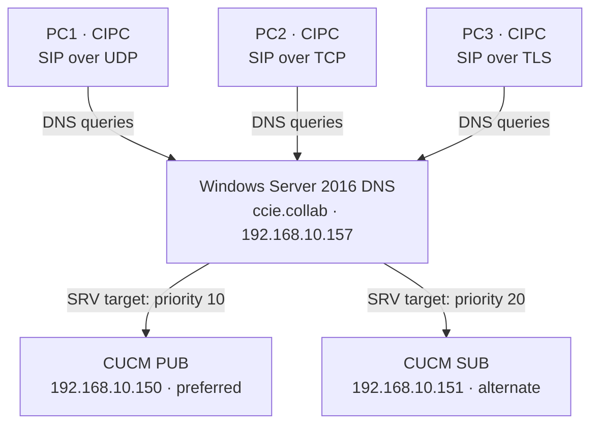

# DNS SRV Records: Importance in the SIP World



**Read the diagram carefully:** DNS *advertises* PUB and SUB through SRV records. A client uses those priorities only if it actually queries and follows the SRV answers. The arrows do not claim that these three CIPC installations used SRV to register.

## Why publish SIP SRV records?

In a collaboration environment, DNS SRV records let compatible clients discover where a service is available. An SRV answer supplies a **server hostname, port, priority, and weight**. This can make SIP service discovery easier to manage and provide alternate targets without entering every server address into every SRV-aware client.

The word **compatible** matters: an SRV record is an advertisement in DNS, not an instruction pushed to every endpoint. The application must know the domain to query and support that discovery method. SIP server location rules are defined in [RFC 3263](https://www.rfc-editor.org/rfc/rfc3263).

## The lab

| Component | Address or name | Role |
|---|---|---|
| Windows Server 2016 | `192.168.10.157` | Authoritative DNS for `ccie.collab` |
| CUCM Publisher | `cucm-pub.ccie.collab` → `192.168.10.150` | Preferred SIP target |
| CUCM Subscriber | `cucm-sub.ccie.collab` → `192.168.10.151` | Alternate SIP target |
| PC1 | Windows 10, CIPC | SIP over UDP |
| PC2 | Windows 11, CIPC | SIP over TCP |
| PC3 | Windows 11, CIPC | SIP over TLS |

The three CIPC phones have existing CUCM configurations. Their DNS tests demonstrate that they can **resolve** the new records; resolution tests alone do not demonstrate that CIPC **uses** the records during registration.

## The six records

Create two targets for each service:

| DNS name | Target | Priority | Weight | Port | Advertised service |
|---|---|---:|---:|---:|---|
| `_sip._udp.ccie.collab` | `cucm-pub.ccie.collab` | 10 | 0 | 5060 | SIP over UDP |
| `_sip._udp.ccie.collab` | `cucm-sub.ccie.collab` | 20 | 0 | 5060 | SIP over UDP |
| `_sip._tcp.ccie.collab` | `cucm-pub.ccie.collab` | 10 | 0 | 5060 | SIP over TCP |
| `_sip._tcp.ccie.collab` | `cucm-sub.ccie.collab` | 20 | 0 | 5060 | SIP over TCP |
| `_sips._tcp.ccie.collab` | `cucm-pub.ccie.collab` | 10 | 0 | 5061 | SIP over TLS |
| `_sips._tcp.ccie.collab` | `cucm-sub.ccie.collab` | 20 | 0 | 5061 | SIP over TLS |

**Priority 10 precedes priority 20** when an SRV-aware client processes these answers. Weight is used to select among records at the **same** priority; both weights here are zero. SRV priority does not mean “send a second INVITE to SUB.” Registration uses **REGISTER**, and an alternate target is considered according to the client’s discovery and failure behavior.

## Create the records on Windows Server 2016

First confirm that both CUCM hostnames have correct **A records** in `ccie.collab`. An SRV record returns a hostname as its target; the client must still resolve that hostname to an address.

On the DNS server, open **Server Manager → Tools → DNS → Forward Lookup Zones → ccie.collab**. Select the zone, then **Action → Other New Records → Service Location (SRV) → Create Record**. Enter the service, protocol, priority, weight, port, and target from the table. Repeat for all six entries. In DNS Manager, expand `_udp` and `_tcp` beneath the zone to inspect the resulting records. Microsoft documents [this SRV creation path](https://learn.microsoft.com/en-us/microsoft-365/admin/dns/create-dns-records-using-windows-based-dns#add-srv-records).

**Check before adding:** if a matching record already exists, inspect its target, port, and priority instead of creating a duplicate.

## Verify on Windows Server 2016 first

Run PowerShell on the DNS server:

```powershell
'_sip._udp','_sip._tcp','_sips._tcp' | ForEach-Object {
    Get-DnsServerResourceRecord -ZoneName 'ccie.collab' `
        -Name $_ -RRType SRV |
        ForEach-Object {
            [pscustomobject]@{
                Service  = $_.HostName
                Priority = $_.RecordData.Priority
                Weight   = $_.RecordData.Weight
                Port     = $_.RecordData.Port
                Target   = $_.RecordData.DomainName
            }
        }
} | Format-Table -AutoSize
```

Expect **six rows**: PUB at priority 10 and SUB at priority 20 for each of the three services. This command inspects records **stored on the DNS server**. Microsoft documents [`Get-DnsServerResourceRecord`](https://learn.microsoft.com/en-us/powershell/module/dnsserver/get-dnsserverresourcerecord).

Next, query DNS as a client would:

```powershell
nslookup -type=SRV _sip._udp.ccie.collab 192.168.10.157
nslookup -type=SRV _sip._tcp.ccie.collab 192.168.10.157
nslookup -type=SRV _sips._tcp.ccie.collab 192.168.10.157
```

Each answer should contain **both** CUCM targets, with the expected port and priority. Confirm the targets resolve too:

```powershell
Resolve-DnsName cucm-pub.ccie.collab -Type A -Server 192.168.10.157
Resolve-DnsName cucm-sub.ccie.collab -Type A -Server 192.168.10.157
```

## Verify from each endpoint

On **PC1, PC2, and PC3**, run the same three `nslookup -type=SRV` commands above. This checks that each PC can reach the authoritative DNS server and retrieve the UDP, TCP, and TLS service advertisements.

| PC | Its phone transport | Most relevant SRV query |
|---|---|---|
| PC1 | SIP/UDP | `_sip._udp.ccie.collab` |
| PC2 | SIP/TCP | `_sip._tcp.ccie.collab` |
| PC3 | SIP/TLS | `_sips._tcp.ccie.collab` |

Running **all three** queries on each PC is a DNS test. It does not switch a phone’s configured transport. A successful `nslookup` proves that **Windows can retrieve the record**; it does not prove that **CIPC requested the record during startup**.

## Prove actual client behavior in Wireshark

Start capturing on the PC’s active Ethernet adapter **before launching CIPC**. Inspect DNS queries with:

```wireshark
dns.qry.type == 33
```

DNS record type **33** is SRV. To focus on the lab DNS server:

```wireshark
dns.qry.type == 33 && ip.addr == 192.168.10.157
```

For hostname resolution:

```wireshark
dns.qry.type == 1 && ip.addr == 192.168.10.157
```

Then inspect the phone’s provisioning and SIP traffic separately. On PC1, for example:

```wireshark
ip.addr == 192.168.20.50 && tcp.port == 6970
```

```wireshark
ip.addr == 192.168.20.50 && udp.port == 5060
```

**What we observed in the PC1 launch capture:** CIPC fetched configuration from PUB, made **A-record** queries for the PUB and SUB hostnames, and sent SIP/UDP REGISTER to PUB, which returned `200 OK`. There was **no SRV query** during that captured launch. The existing CIPC deployment therefore cannot be presented as proof that its PUB selection came from SRV priority. Cisco describes [the phone obtaining configuration before registering](https://www.cisco.com/c/en/us/td/docs/voice_ip_comm/cucm/admin/12_5_1SU2/systemConfig/cucm_b_system-configuration-guide-1251su2/cucm_b_system-configuration-guide-for-cisco-1251su2_chapter_011111.html).

## Where SRV fits—and where it does not

- **SRV-aware SIP discovery:** Given a SIP domain, a supporting client can use DNS to find SIP service targets and ports.
- **CIPC configuration discovery:** The SIP SRV records above do not supply CIPC’s initial TFTP address. In this lab, the TFTP servers were entered in **CIPC Preferences → Network**. [DHCP option 150](https://www.cisco.com/c/en/us/td/docs/voice_ip_comm/cucm/admin/12_5_1SU2/systemConfig/cucm_b_system-configuration-guide-1251su2/cucm_b_system-configuration-guide-for-cisco-1251su2_chapter_011111.html) is another documented way for phones to discover TFTP.
- **CUCM server selection in this capture:** The PC1 packets show A lookups and registration to PUB; they do not show SRV-based selection.
- **TLS security:** `_sips._tcp` advertises a TLS SIP service. The record itself does not install certificates, authenticate the phone, or prove that media is encrypted. Those are separate CUCM, endpoint, and packet checks.

## RFC references

- [RFC 2782 — A DNS RR for specifying the location of services](https://www.rfc-editor.org/rfc/rfc2782): SRV fields and selection behavior.
- [RFC 3263 — SIP: Locating SIP Servers](https://www.rfc-editor.org/rfc/rfc3263): when a SIP client uses NAPTR, SRV, and A/AAAA to locate a server.
- [RFC 3261 — SIP: Session Initiation Protocol](https://www.rfc-editor.org/rfc/rfc3261): REGISTER and SIP signaling.
